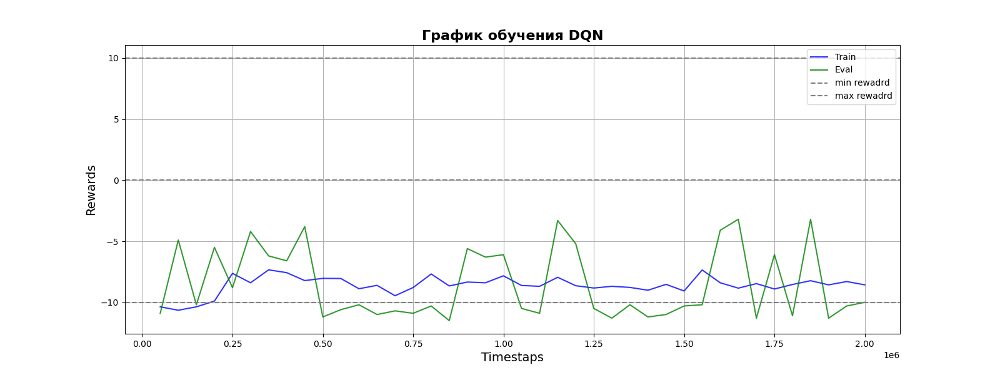
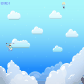
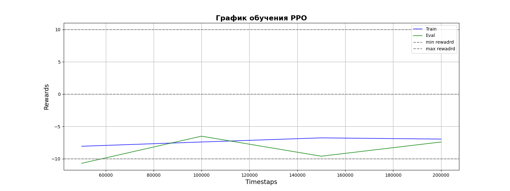
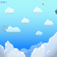

# <center> **HeliRescue RL Project**

Проект посвящен обучению агента с подкреплением для пользовательской игры HeliRescue, реализованной на pygame. В исходной игре игрок управляет вертолётом, должен подбирать падающего парашютиста и избегать столкновения с кораблем пришельцев. Сама игровая логика находится в game.py: счет увеличивается при спасении парашютиста, уменьшается при его потере, а эпизод завершается при достижении +10 или -10 очков.

В рамках проекта игра была адаптирована в виде кастомной среды gymnasium, после чего были проведены эксперименты с алгоритмами DQN и PPO из stable-baselines3. Основная цель эксперимента — проверить, насколько хорошо агент способен выучить стратегию управления по визуальным наблюдениям и какие настройки обучения оказываются наиболее эффективными.

## <center> **Описание игры**

Игровое поле имеет размер 1000x700. Вертолeт управляется по четырeм направлениям и движется с фиксированной скоростью. Парашютист падает сверху вниз со случайной скоростью, а пришелец движется справа налево и также имеет случайную скорость. 

### Основные правила:

+ +1 за спасение парашютиста;
+ -1 если парашютиста перехватывает пришелец;
+ мгновенное поражение при столкновении вертолета с пришельцем;
+ завершение игры при достижении счета +10 или -10.

Такая постановка создает нетривиальную задачу для RL: агенту нужно одновременно отслеживать несколько движущихся объектов, учитывать долгосрочные последствия действий и работать с редкими положительными событиями.

## <center> **Постановка RL-задачи**

Для обучения была реализована кастомная среда HeliRescueEnv, совместимая с gymnasium. В качестве наблюдения использовались кадры игры, уменьшенные до 84x84, затем переведенные в grayscale и объединенные в стек из нескольких последовательных кадров. Это позволило агенту учитывать не только текущее положение объектов, но и их движение.

Action space было дискретным и включало 5 действий:

+ 0 — бездействие;
+ 1 — движение влево;
+ 2 — движение вправо;
+ 3 — движение вверх;
+ 4 — движение вниз.

Для обучения и оценки использовались векторизованные окружения DummyVecEnv, стек кадров VecFrameStack, а также мониторинг эпизодов через RecordEpisodeStatistics и VecMonitor.

## <center> **Алгоритмы и серия экспериментов**

В работе сравнивались два подхода:

#### **1. DQN**

Базовая модель DQN обучалась на визуальных наблюдениях с использованием CnnPolicy. Несмотря на длительное обучение и большой replay buffer, агент не смог выйти из устойчиво отрицательной области наград. Средняя награда оставалась около -8 ... -10, а сама политика была близка к случайной.



Этот результат хорошо показывает ограничение классического DQN для данной задачи: в среде с редкими успешными событиями и длинными эпизодами оценка Q-функции получается шумной, а улучшения накапливаются слишком медленно.



#### **2. PPO**

Дальнейшие эксперименты были проведены с PPO. Этот алгоритм показал себя лучше уже в первой конфигурации: средняя train-награда поднялась примерно до -5 ... -6, однако политика всe ещe оставалась нестабильной, а eval-результаты часто опускались к -10.



После последовательной настройки гиперпараметров удалось получить более сильную модель PPO, которая стала лучшей среди всех протестированных вариантов.



**Лучшая конфигурация PPO**

Финальная модель PPO обучалась со следующими параметрами:

```python
N_ENVS = 4
TOTAL_TIMESTEPS = 3_000_000

model_ppo_2 = PPO(
    policy="CnnPolicy",
    env=train_env,
    learning_rate=2.5e-4,
    n_steps=512,
    batch_size=512,
    n_epochs=4,
    gamma=0.99,
    gae_lambda=0.95,
    clip_range=0.2,
    ent_coef=0.01,
    vf_coef=0.5,
    max_grad_norm=0.5,
    verbose=1,
)
```
Почему именно эта конфигурация оказалась лучшей:

+ Более длинное обучение (3M шагов) дало агенту достаточно времени, чтобы накопить полезный опыт в сложной визуальной среде.
+ Большие rollout'ы (n_steps=512) улучшили качество оценки advantage и сделали обновления более устойчивыми.
+ Расширенный clip range (0.2) позволил политике обновляться заметнее, а не делать слишком осторожные шаги.
+ Умеренная энтропия (ent_coef=0.01) сохранила исследование, но уже не мешала закреплять найденную стратегию.

### **Итоговый вывод**

Проведeнные эксперименты показали, что задача HeliRescue действительно сложна для визуального обучения с подкреплением. Базовый DQN не смог выучить полезную стратегию и оставался близок к случайному поведению. PPO оказался заметно устойчивее и лучше справился с задачей, особенно после настройки гиперпараметров.

Лучшая модель PPO не решила задачу полностью, однако достигла наиболее сильного результата среди всех протестированных конфигураций: она существенно уменьшила средний штраф, стала реже проигрывать и выработала более осмысленную политику действий. Это позволяет считать выбранную конфигурацию рабочей базой для дальнейших улучшений.

## <center> **Как запустить проект**
1. Установить зависимости

Рекомендуется Python 3.13.8 

```bash
pip install gymnasium stable-baselines3[extra] pygame imageio matplotlib numpy
```

Если используется Jupyter Notebook:

```bash
pip install notebook ipykernel
```
2. Запуск исходной игры

Из каталога проекта:

```bash
python game.py
```
3. Запуск обучения
Обучение удобнее запускать из Jupyter Notebook или отдельного Python-скрипта, где:

создаeтся HeliRescueEnv;

применяются wrappers (GrayScaleObservationCustom, AddChannelDimFirst, VecFrameStack, VecMonitor);

инициализируется модель PPO или DQN;

запускается model.learn(...).

4. Визуализация агента

Для визуализации можно использовать:

render_mode="human" — для ручного просмотра;

render_mode="rgb_array" — для сохранения кадров и сборки GIF/видео.

Пример цикла оценки с записью кадров:

```python
frames = []
obs = eval_env.reset()
for _ in range(1000):
    action, _ = model.predict(obs, deterministic=True)
    obs, reward, done, info = eval_env.step(action)
    frames.append(eval_env.render())
    if done:
        break
```
Воспроизводимость

Для воспроизводимости экспериментов желательно:

фиксировать seed для всех окружений;

сохранять конфигурацию гиперпараметров в отдельный .yaml или .json;

отдельно логировать train/eval метрики и сохранять графики в plots/.